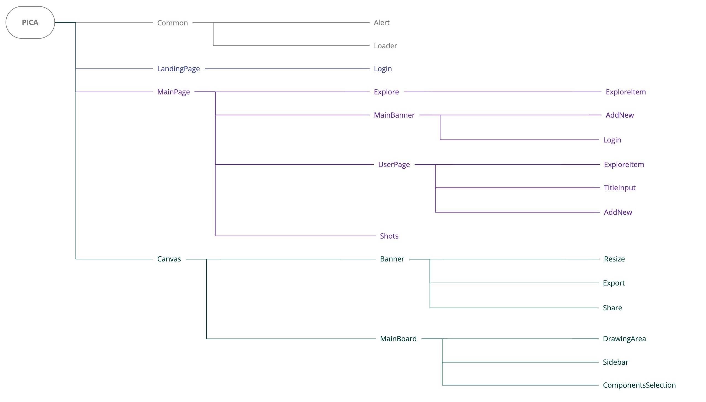

<!-- # PICA -->

  

  <!-- <h3 align="center">PICA</h3> -->

  

   An online designing tool integrated with exploring and sharing systems.
     
    <a href="https://pica-b4a59.web.app/"><strong>View Website »</strong></a>
     
  
 

## Demo

PICA: https://pica-b4a59.web.app/

<!-- User: test@gmail.com Password: 123456 -->

## Technologies

-   Front-End Basic
    -   HTML / CSS / JavaScript
    -   SCSS
    -   RWD
-   Front-End Frameworks
    -   React
    -   React Router
-   Firebase
    -   Database
    -   Storage
    -   Hosting
    -   Authentication
-   Other
    -   Version Control : Git / GitHub

## Core Components Structure

## Website Demo

-   ### Add elements to design

    

-   ### Adjust elements in design

    

-   ### Export my design

    

-   ### Explore designs and add to like list

    

-   ### Check design details and comment

    

-   ### Check my designs and like list

    

-   ### Add new design

    

## Contact

E-mail: vivi2393142@gmail.com
