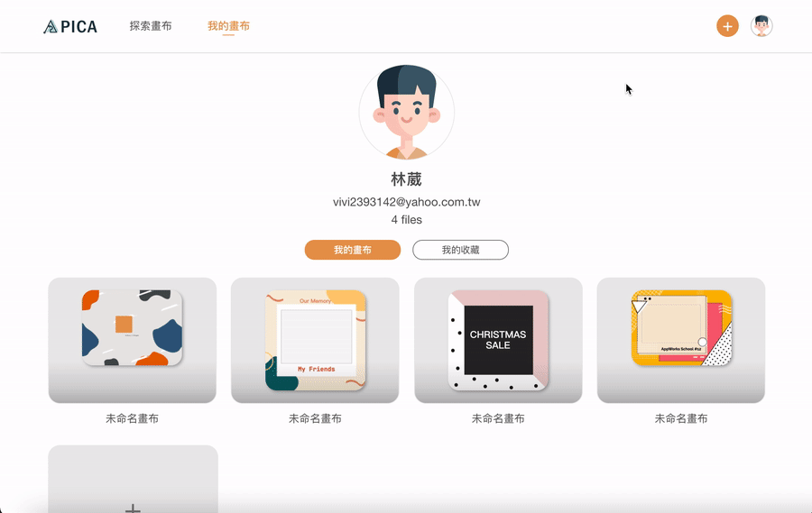

<!-- # PICA -->

  

  <!-- <h3 align="center">PICA</h3> -->

  

   An online designing tool integrated with exploring and sharing systems.
     
    <a href="https://pica-b4a59.web.app/"><strong>View Website »</strong></a>
     
  
 

<kbd>
    
</kbd>

## Technologies

-   Front-End Basic
    -   HTML / CSS / JavaScript
    -   SCSS
    -   RWD
-   Front-End Frameworks
    -   React
    -   React Router
-   Firebase
    -   Database
    -   Storage
    -   Hosting
    -   Authentication
-   Library
    -   Fabric.js
-   Other
    -   Version Control : Git / GitHub

## Core Components Structure

## Website Demo

### Design Editing Page

-   #### Various elements to use

    Provided with various elements to use, including text, shapes, lines, images, stickers, background, upload and templates to choose from.

    <kbd>
    
    </kbd>

-   #### Add elements to design

    Click or Drag to add new element in own design.

    <kbd>
    
    </kbd>

-   #### Adjust elements in design

    -   Basic Adjusting Functions:

        Copy, paste, redo, undo, align, layer move, etc.

    -   Particular Adjusting Functions:

        For example, image elements can do crop and filter while text elements can choose color, font weight and text alignment.

    <kbd>
    
    </kbd>

-   #### Export my design

    Users can export the design to jpg, png or pdf file, or share the file details page link.

    <kbd>
    
    </kbd>

-   #### Responsive web design

    Realigning all selection bars and adjusting mouse over events on mobile view.

    <kbd>
    
    </kbd>

### Explore, Self & File Information Page

-   #### Explore designs and add to like list

    Explore all designs, including templates and others' designs.

    <kbd>
    
    </kbd>

-   #### Check design details and comment

    Check information of design like author information and comments, and can also send or edit my comment.

    <kbd>
    
    </kbd>

-   #### Check my designs and like list

    Check all my designs which link to the edit page, and all designs in the like list.

    <kbd>
    
    </kbd>

-   #### Add new design

    User-friendly adding steps with clear guidances.

    <kbd>
    
    </kbd>

## Contact

E-mail: vivi2393142@gmail.com
